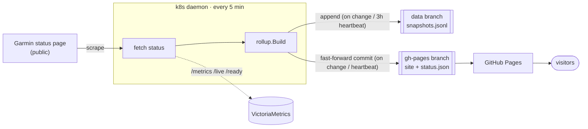

# garminstatus

An **unofficial** status page for Garmin Connect, with 180 days of uptime history.

A small **daemon** (deployed in Kubernetes) polls Garmin's public status page every few
minutes and publishes the result to GitHub over an SSH deploy key, using three branches:

- **`master`** — code + static site source only (branch-protected, CI required).
- **`data`** — the append-only "database" (`data/snapshots.jsonl`, a change-log).
- **`gh-pages`** — the rendered site (served by GitHub Pages).

> Live page: **https://tamcore.github.io/garminstatus/**
>
> Not affiliated with Garmin. Status is scraped from Garmin's public status page.

## How it works



- The `data` branch grows only when a service's status changes (plus a periodic
  heartbeat), so its history stays meaningful and small.
- The `gh-pages` branch gets a normal **fast-forward** commit whenever the change-log
  advances, with `status.json.generated` stamped at publish time. GitHub Pages serves the
  branch directly and each build completes — a force-pushed rolling commit would be
  orphaned mid-build and never publish.
- Uptime is reconstructed by time-weighted integration between recorded transitions.

## Commands

```sh
go run . status              # fetch current status, print JSON (default)
go run . snapshot            # append a change-log record if status changed (local file)
go run . build               # render site/data/status.json from a local change-log
go run . daemon --repo git@github.com:tamcore/garminstatus.git --key /keys/id_ed25519
                             # the k8s collect+publish loop
```

`daemon` flags: `--interval` (default `5m`), `--heartbeat` (default `3h`), `--repo`
(SSH remote), `--key` (deploy-key path), `--work` (clone dir, default `/work`), `--http`
(metrics/health addr, default `:8080`).

## Metrics

Exposed on `/metrics`:

- `garmin_platform_status{service}` / `garmin_feature_status{service}` — 1 up / 0 down.
- `garminstatus_fetch_success` — last Garmin fetch (1/0).
- `garminstatus_sync_success{branch,op}` / `garminstatus_sync_timestamp_seconds{branch,op}`
  / `garminstatus_sync_errors_total{branch,op}` — git pull/push health per branch.
- `garminstatus_cycle_timestamp_seconds` — last completed loop.

## Data formats

**`data/snapshots.jsonl`** (data branch) — append-only change-log, one JSON object per line:

```json
{"ts":"2026-07-08T12:00:00Z","kind":"change","platforms":{"Garmin Connect":{"status":"up"}},"features":{}}
```

**`data/status.json`** (gh-pages branch) — pre-aggregated artifact the page reads:

```json
{
  "generated": "2026-07-08T12:05:00Z",
  "dataThrough": "2026-07-08T12:00:00Z",
  "services": {
    "platforms": [{"name":"Garmin Connect","current":"up","days":[{"date":"2026-04-01","upFrac":0.993,"worst":"down"}]}],
    "features": []
  },
  "incidents": [{"service":"Garmin Connect","start":"...","end":"...","reasons":[]}]
}
```

## Local development

```sh
go test ./...
go run . snapshot && go run . build   # writes ./data + ./site/data locally
cd site && python3 -m http.server     # open http://localhost:8000
```

## License

See repository metadata.
